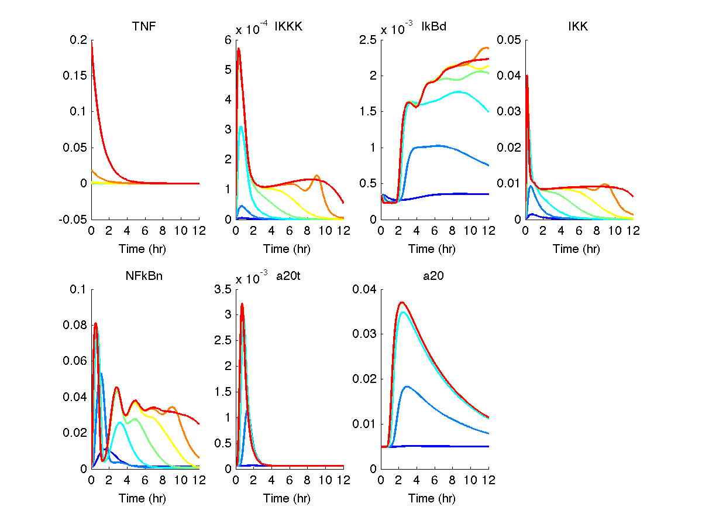

# A ODE model for Marie's cell death project 

## Sources of the model 

* [Werner et al. 2008 G&D] -  The TNF Receptor module (with correction) 
* [Vincent et al. 2009 PNAS] - The IkB-NFkB module (including IkBd)

## run the model

 * test_run.m - run the dose response of TNF (0.001,.01,.1,1,10,100,100
 ng/ml )

The result will be like :

## TODOs:
* The NFkB basal is a little bit high

